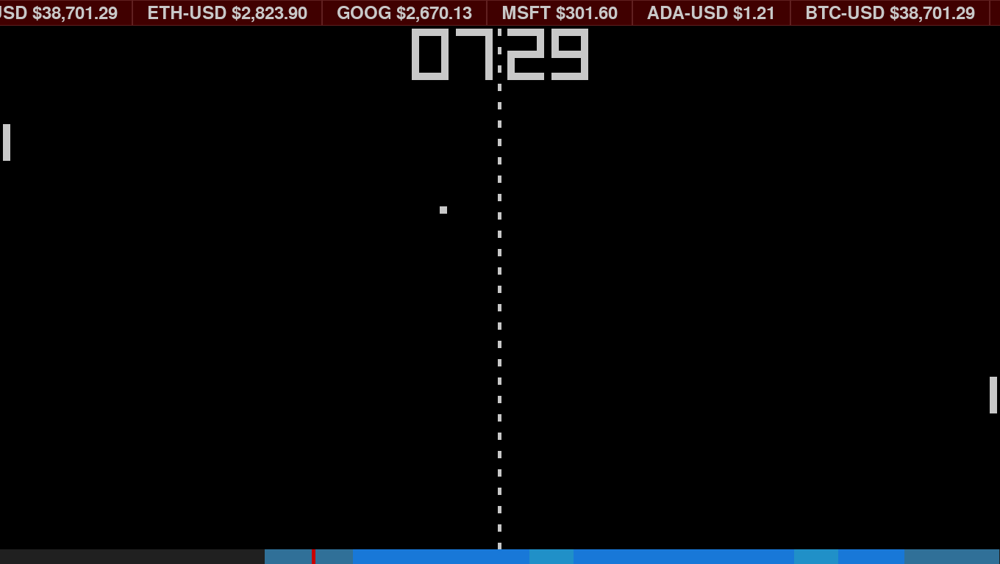
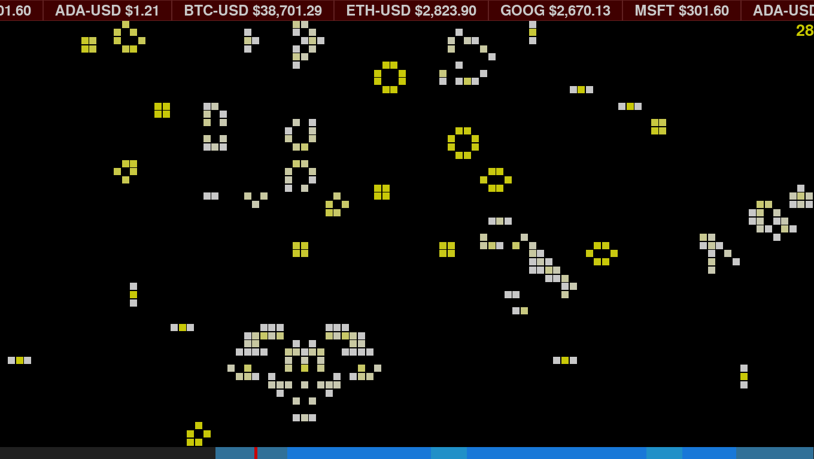

# PiDisplay

I have a chair.

I have a desk in front of my chair.

I have a Raspberry Pi on my desk, that is in front of my chair.

I have a 7" screen attached to my Raspberry Pi, that sits on my desk, that is in front of my chair.

So, what can I do with all this?  I know!  Wouldn't it be great if I had a fancy desk ornament that displays a rotating list of fun gadgets like:

- PongClock (a game of Pong that plays itself, but keeps time with the score)
- Picture slideshow
- Conways Game of Life
- Current weather (sometimes I go outside... sometimes)
- Current news headlines
- Stock ticker
- Clok widget

...and all this in an easily customizable, extensible, modular format that allows other developers to easily extend it with their own ideas?  Oh, such a neat idea...

---

PiDisplay is an application (written in python) that gives you a slideshow of neat things you may want to display on a small screen that sits on your desk or hung on a wall.

---
# Screenshots
On the top and bottom of each of these screenshots you can see the ticker and the clok.







# Installation
1) Log into your Raspberry Pi console.
2) You may have to install git
````commandline
sudo apt install git
````
3) Clone this git repository
````commandline
git clone https://github.com/nomachinez/pidisplay.git
````
4) Edit the \_\_init__.py files in each module directory to enable/disable any modules you want/don't want.  They are all enabled by default.
````commandline
./pidisplay/plugins/ticker/__init__.py
./pidisplay/plugins/newsfeed/__init__.py
./pidisplay/plugins/picture_viewer/__init__.py
./pidisplay/plugins/pongclock/__init__.py
./pidisplay/plugins/clok/__init__.py
./pidisplay/plugins/gameoflife/__init__.py
./pidisplay/plugins/openweathermap_forecast/__init__.py
````

To disable, set:
````commandline
ENABLED = False
````
5) Edit the config files (optional, but recommended). The settings in the configs are great for my [1360x768 7" screen](https://www.amazon.com/Eviciv-Portable-Monitor-Display-1024X600/dp/B07L6WT77H). You may want to adjust them if your screen is different.  There are many settings in here but the ones to look at first are:
- __pidisplay/config.py__ 
  - Set fullscreen/resolution
  - Set system font
  - Set top bar and bottom bar height
  - Set the autoswitch timer delay (how long to wait before switching to the next module)
- __pidisplay/plugins/ticker/ticker_config.py__
  - Set the stock/crypto tickers to track
- __pidisplay/plugins/newsfeed/newsfeed_config.py__
  - Configure any RSS feeds you want. You can add as many as you want, and it will show only the latest number (across all feeds) that will fit on your screen.
  - If you configure a Slack webhook url, when you click on a news article it will send you the link to your Slack channel.  This is very useful if you find something you want to read and want to send the url to your phone or computer.
- __pidisplay/plugins/picture_viewer/picture_viewer_config.py__
  - Set the slideshow delay
  - Set your picture folder if you already have your pictures in another folder 
- __pidisplay/plugins/pongclock/pongclock_config.py__
  - Nothing of note in here unless you want to mess around with the colors
- __pidisplay/plugins/clok/clok_config.py__
  - Configure the time periods when you are most active and choose a series of colors that represent your activity level for that time period.
- __pidisplay/plugins/gameoflife/gameoflife_config.py__
  - Nothing of note in here unless you want to mess around with the world size and colors.
- __pidisplay/plugins/openweathermap_forecast/openweathermap_forecast_config.py__
  - Enter your openweathermap api key ([sign up for a free account](https://openweathermap.org/api) and configure a [new API key](https://home.openweathermap.org/api_keys))
  - Enter the longitude/latitude of the location for which you want to track weather.
6) Install other python modules to support the plugins (required if you elect to use the respective module):
````commandline
sudo pip3 install yfinance  # for the ticker module. I had to reinstall numpy after installing yfinance. It took a while.
sudo pip3 install feedparser  # for the news module
````
7) Run it!
````commandline
python3 pidisplay/pidisplay.py
````

# TODO:

- Add moon phase to weather
- Fix the paddles in the pongclock. The paddles track the ball correctly only about 90% of the time.
