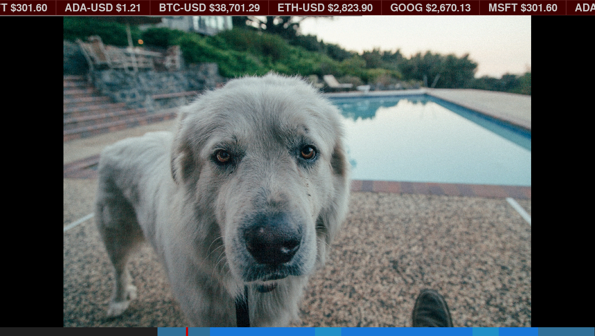
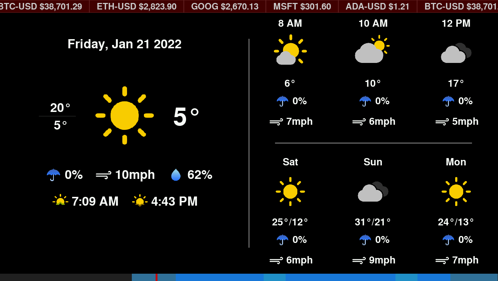

# PiDisplay

I have a chair.

I have a desk in front of my chair.

I have a Raspberry Pi on my desk, that is in front of my chair.

I have a 7" screen attached to my Raspberry Pi, that sits on my desk, that is in front of my chair.

So, what can I do with all this?  I know!  Wouldn't it be great if I had a fancy desk ornament that displays a rotating list of fun gadgets like:

- PongClock (a game of Pong that plays itself, but keeps time with the score)
- Picture slideshow
- Conways Game of Life
- Pi-Hole status console
- Current weather (sometimes I go outside... sometimes)
- Current news headlines
- Stock ticker widget
- Spotify "Now Playing" ticker widget
- Spotify "Now Playing" full screen display
- System Information panel
- Clok widget

...and all this in an easily customizable, extensible, modular format that allows other developers to easily extend it with their own ideas?  Oh, such a neat idea...

---

PiDisplay is an application (written in python) that gives you a slideshow of neat things you may want to display on a small screen that sits on your desk or hung on a wall.

---
# Features
- All the modules listed above!
- Double-tap/click on the screen to manually move to the next module
- Newsfeed - tap/click on an article to send the link to a Slack channel
- Conways Game of Life - tap/click on the screen to reset the world
- Picture Viewer - tap/click on the screen to move to manually move to the next picture
- Enable/Disable individual modules/plugins
- Multiple modules running at the same time. Show weather in 2 different places!  Show multiple tickers with different symbole!
- Easy to extend with other modules (use the Clok module for an example widget and the GameOfLife module for an example full screen module)

# Screenshots
On the top and bottom of each of these screenshots you can see the ticker and the clok.






Multiple widgets on the top and bottom:


# Requirements
- python3
- various python3 modules:
  - **pygame** should already be included on your system but is required to run PiDisplay at all
  - **pillow** is for the Picture Viewer and Now Playing plugins
  - **spotipy** is for the Now Playing and Now Playing Ticker plugins
  - **feedparser** is for the News Feed plugin
  - **requests** is for the Ticker, Pi-Hole, News Feed, Now Playing, System Info and OpenWeather Maps plugins. Probably already included on your system.
  - **yfinance** is for the Ticker plugin
    - **numpy** yfinance requires this and is known to give Raspberry Pi folks trouble during installation. 

# Installation
1) Log into your Raspberry Pi console.
2) You may have to install git
````commandline
sudo apt install git
````
3) Clone this git repository
````commandline
git clone https://github.com/nomachinez/pidisplay.git
````
4) Edit the ./pidisplay/config.ini file to your liking.  Some notes about the config.ini file(s):
   1) All settings in each of the plugins can be overridden in the main config.ini file.
   2) Take a look at the config.ini file in each plugin directory for all the options available to you for each plugin.
   3) Some plugins (e.g., openweathermap, nowplaying) require you to enter an api key or client id/username, which should be entered in the ./pidisplay/config.ini file.
   4) Any widgets need a widget_location = top or widget_location = bottom in the main config.ini file for it to show up.
   5) Plugins will be loaded and cycled through in the order present in the main config.ini file.
   6) If you want a particular plugin to stay on the screen longer/shorter than the default "autoswitch_timer" value, enter autoswitch_timer = # in the section for that plugin with the number of seconds you want.
   7) You can load a plugin multiple times by adding it multiple times in the main config file. Just make sure to name it something different. The options can be managed seperately as well (e.g., 2 tickers with different symbols and speeds)
   8) To disable a plugin, remove it or comment it out in the main config.ini file.

5) The settings in the main config.ini file are great for me and my [1360x768 7" screen](https://www.amazon.com/Eviciv-Portable-Monitor-Display-1024X600/dp/B07L6WT77H). You may want to adjust them if your screen is different.  There are many settings that can be overriden in here but the ones to look at first are:

**(BE SURE to edit the main config.ini file, NOT the config.ini file in each plugin folder. It is there for your reference/documentation only and can/will be overritten when you upgrade)**
- __Main config.ini__ 
  - Set fullscreen/resolution
  - Set system font
  - Set default widget height
  - Set the default autoswitch timer delay (how long to wait before switching to the next module)
- __pidisplay/plugins/ticker__
  - Set the stock/crypto tickers to track
- __pidisplay/plugins/newsfeed__
  - Configure any RSS feeds you want. You can add as many as you want, and it will show only the latest number (across all feeds) that will fit on your screen.
  - If you [configure a Slack webhook url](https://api.slack.com/messaging/webhooks), when you click on a news article it will send you the link to your Slack channel.  This is very useful if you find something you want to read and want to send the url to your phone or computer.
- __pidisplay/plugins/picture_viewer__
  - Set the slideshow delay
  - Set your picture folder if you already have your pictures in another folder 
- __pidisplay/plugins/pongclock__
  - Nothing of note in here unless you want to mess around with the colors
- __pidisplay/plugins/clok__
  - Configure the time periods when you are most active and choose a series of colors that represent your activity level for that time period.
- __pidisplay/plugins/gameoflife__
  - Nothing of note in here unless you want to mess around with the world size and colors.
- __pidisplay/plugins/openweathermap_forecast__
  - Your openweathermap api key ([sign up for a free account](https://openweathermap.org/api) and configure a [new API key](https://home.openweathermap.org/api_keys))
  - The longitude/latitude of the location for which you want to track weather.
- __pidisplay/plugins/nowplaying and pidisplay/plugins/nowplaying_ticker__
  - Update your Spotify client_id and username
- __pidisplay/plugins/pihole__
  - Update the ip address of your Pi-Hole server, if it's not the same as the one running PiDisplay
- __pidisplay/plugins/systeminfo__
  - Update the font size for your screen

6) The yfinance python3 module requires the numpy python3 module which requires you to first install the libatlas3-base package on your computer.  For Raspberry Pis, or any other debian-based system you should be able to install this easily like this:
````commandline
sudo apt install libatlas3-base
````
7) Install other python modules to support the included plugins (required if you elect to use the respective module):
````commandline
sudo pip3 install pillow spotipy feedparser psutil pygame requests yfinance
````

7) Run it!
````commandline
python3 pidisplay/pidisplay.py
````
8) (Optional) Configure your Raspberry Pi to log in automatically and automatically start PiDisplay
```commandline
sudo raspi-config
```
   * Choose option "1 System Options"
   * Choose option "2 S5 Boot / Auto Login"
   * Choose option "B2 Console Autologin"
   * Choose "\<Finish>"
   * Don't reboot yet.

Now add the startup to your .bashrc
````commandline
echo python3 ~/pidisplay/pidisplay.py >> /home/pi/.bashrc
````

Reboot
````commandline
reboot
````

# Instructions for adding multiple widgets on the top and bottom (e.g., Ticker)
1) Open up the main config.ini file in ./pidisplay/config.ini
2) Copy the section you want to duplicate and paste it back in, so now you have 2 of them.
3) Change the section title of the second one to something different
4) Modify any settings you choose.
e.g.
````commandline
.....SNIP......

[ticker1]
class = Ticker
tickers = ["msft", "goog"]
speed = 1
widget_location = top

......SNIP......

````
becomes
````commandline
......SNIP......

[ticker1]
class = Ticker
tickers = ["msft", "goog"]
speed = 1
widget_location = top

[ticker2]
class = Ticker
tickers = [ada-usd", "eth-usd", "btc-usd"]
speed = -2
widget_location = bottom

......SNIP......
````

# TODO

- Add moon phase to weather
- Fix the paddles in the pongclock. The paddles track the ball correctly only about 90% of the time.
- Add location to weather plugin

# Changelog

01-02-2022
- Redesigned/Matured configuration system
- Redesigned/Matured plugin system
- Added Spotify Now Playing ticker widget
- Added Spotify Now Playing module
- Made the picture viewer a little fancier
- Added System Info plugin
- Added Pi-Hole Info plugin
- Made it so the height of each widget bar can be customized individually
- Made it so each full screen plugin can have its own auto switch delay
